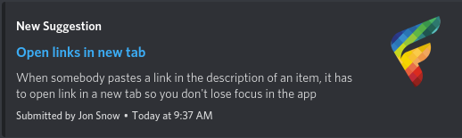

# Fider Webhook

A Node.js script that polls the [Fider API](https://getfider.com/docs/api) to post updates to a [Discord webhook](https://support.discord.com/hc/en-us/articles/228383668-Intro-to-Webhooks).

## Installation

1. Install [Node.js](https://nodejs.org/).
2. Clone this repo: `git clone https://github.com/FOSSforlife/fider-webhook`
3. Install dependencies: `cd fider-webhook && npm i`

## Usage

First, [create a webhook](https://support.discord.com/hc/en-us/articles/228383668-Intro-to-Webhooks). Then copy `.env.example` to a file named `.env`, and add the following variables:
- `FIDER_URL`: The URL of your Fider installation, e.g. `https://feedback.fider.io`
- `WEBHOOK_URL`: The URL of the webhook you've created.
- `THUMBNAIL_URL`: (Optional) An icon to be embedded in each post. By default, the [Fider logo](https://github.com/getfider/fider/blob/main/favicon.png) is used.
- `UPDATE_INTERVAL`: (Optional) An integer from 1 to 60 specifying minutes between each update. For example, `1` would retrieve updates from Fider every minute, `60` would retrieve updates every hour. (Default: 15)

Then, run `node index.js`, leave the terminal open, and now every 15 minutes new posts will be posted to the webhook specified.

Alternatively, you can run this in the background using something like [PM2](https://pm2.keymetrics.io).

## Example

